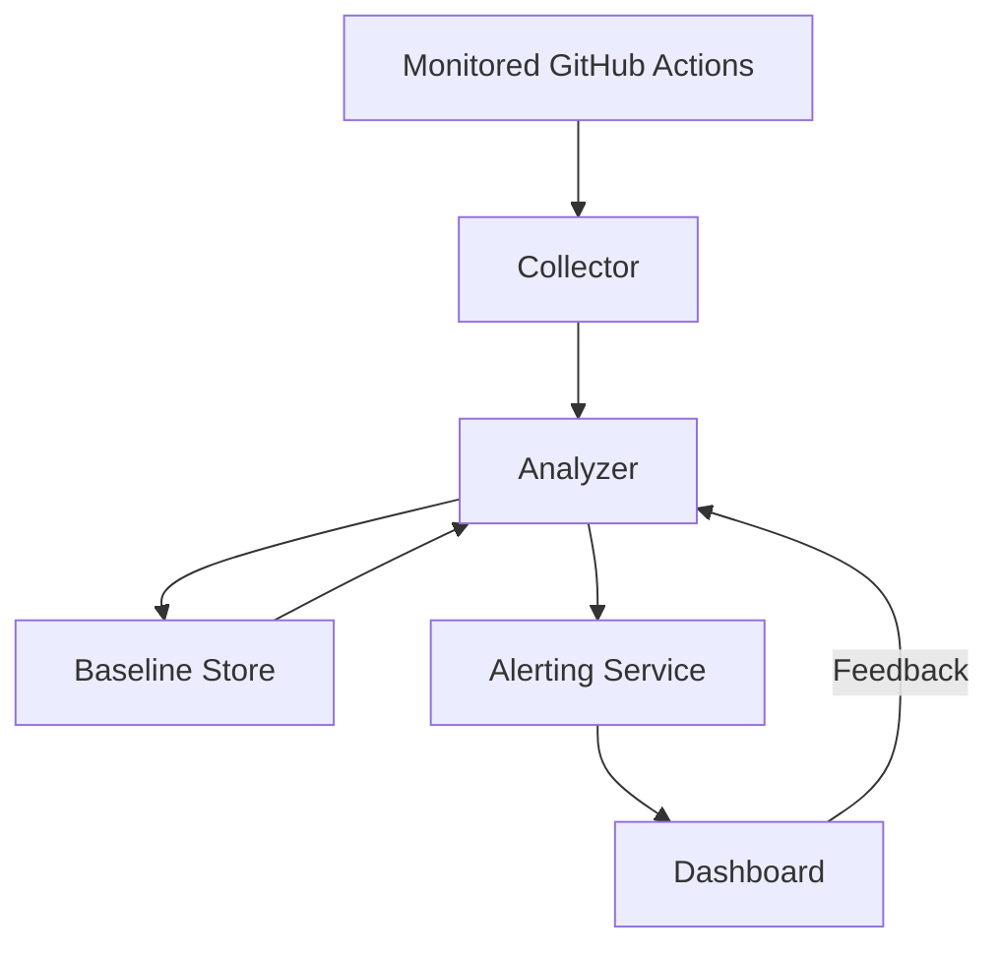

# GitHub Actions Supply Chain Attack Detection System

## 1. Detection Strategy Design

### Data sources
* GitHub API for commit history, releases, workflow files of watched actions
* GitHub release assets or action code from default branch or tag
* Build logs from observed repositories using the actions (via GitHub API or logs scanning)
* Security advisories or vulnerability databases for new CVEs

### Key attack indicators and behavioral patterns
1. Unexpected changes in action source code that deviate from prior behavioral baseline (e.g., new network calls, secret exfiltration, added logging of secrets)
2. Sudden injection of obfuscated or minified code, suspicious shell commands, or dependency changes with suspicious packages
3. New maintainers or compromised commit signatures
4. Inconsistent file changes across tags vs commit history (i.e., mismatched releases)
5. Changes that maintain functionality but add side effects such as writing environment variables to logs

### Differentiating legitimate updates from compromises
* Use static analysis and diffing to build a baseline of historical behavior for each action (system calls, network destinations, number of files, and dependency versions)
* Flag changes that introduce new behavior categories (e.g., adding network requests where none existed)
* Correlate commit authorship and signing keys with known maintainers
* Use anomaly scoring per release to prioritize suspicious commits for review
* Establish manual review workflow for high-risk alerts

### Scalability considerations
* Use GitHub webhooks or scheduled polling to detect new commits/releases across thousands of actions
* Store metadata and diffs in a centralized database for incremental analysis
* Perform static analysis in parallel using workers or serverless functions
* Cache prior analysis results to reduce repeated work
* Provide alerting pipeline to security analysts with prioritized risk scores

## 2. Technical Architecture

### System components
1. **Collector**
   * Polls GitHub API or consumes webhooks to detect new commits, releases, or tag updates for watched actions.
   * Downloads source archives for each new version.
2. **Baseline Store**
   * Database storing historical versions, metadata, and analysis results for each action.
   * Maintains fingerprints such as file hashes, dependency versions, and behavioral features.
3. **Analyzer**
   * Performs static code analysis and diffing between new and previous versions.
   * Extracts indicators (e.g., added network domains, new scripts). Uses rule-based and heuristic checks for suspicious patterns.
4. **Alerting Service**
   * Aggregates anomalies and applies scoring logic to determine if manual review is required.
   * Sends alerts to security analysts via email/Slack or dashboards.
5. **Dashboard**
   * Allows analysts to inspect diffs, investigation context, and mark alerts as benign or malicious.

### Data Flow
1. Collector identifies a new release/commit of a monitored action and downloads its source.
2. Analyzer compares it to the previous baseline stored in the database.
3. Analyzer flags anomalies and stores new baseline data.
4. Alerting Service scores and dispatches alerts.
5. Analysts use the dashboard to confirm or dismiss the alert, feeding results back into the system for tuning.

### Architecture Diagram

### Detection logic and analysis pipeline
* **Static diffing**: Compute file diffs and run rule-based checks for suspicious additions (e.g., `echo $GITHUB_` patterns, network utilities, curl/wget to unknown hosts).
* **Behavioral profiling**: Build features like number of scripts, external dependencies, network endpoints. Flag abrupt changes.
* **Maintainer verification**: Validate commit signatures and account activity against known maintainers. Flag new committers with no history.
* **Secret exposure detection**: Scan for references to sensitive variables such as `GITHUB_TOKEN`, `aws_access_key_id`, or writes to `$GITHUB_OUTPUT`.
* **Network endpoint analysis**: Collect domains contacted by the action and flag new or untrusted destinations.
* **Automatic sandbox run** (optional): Execute the action in an isolated environment to observe runtime behavior and watch for secrets exfiltration or unexpected network calls.

This design enables rapid detection of compromised GitHub Actions across a large catalog, allowing security teams to respond quickly to supply chain attacks.
